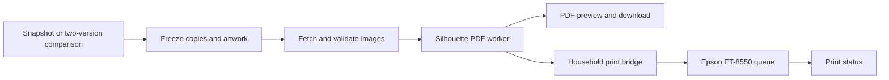

# Household PDF and printing workflow

Status: proposed next feature, reviewed 2026-09-08. **No PDF generator, print API, or
printer bridge is implemented in CLC yet.** This design builds on the existing snapshot,
paper-deck, artwork-selection, and image-download features. Household hardware settings
still need to be supplied and tested.

## Intended experience

From a tracked deck, a player chooses **Print latest snapshot** or **Print changes**.
Changes can use the marked paper snapshot or any explicit earlier snapshot as the baseline.
CLC shows the exact source and target versions, copies needed, unresolved artwork, and
sheet count. The player can download the PDF or send it to the configured household queue.
Once that printer recipe is validated, preparing and queueing can be one action.

Drying tracking is out of scope: the household normally waits about an hour before
laminating. Printing does not mark the physical deck as updated; the player updates the
paper marker when the cut and assembled deck actually matches the snapshot.



## What can be reused

| Existing CLC code | Contribution | Required extension |
| --- | --- | --- |
| `server/routes/snapshots.js` | Version text, comparisons, paper baseline | Resolve "latest" once when the request is created |
| `src/lib/parser.js`, `differ.js` | Counts, sections, printing metadata | Dedicated physical-copy planner with complete printing/face identity |
| `server/routes/decks.js`, `MpcOverlay.jsx` | Saved artwork choices | Freeze selected front/back IDs per job, rather than resolving again later |
| `server/lib/downloadQueue.js` | Persisted jobs, limits, progress, retries | Separate print lifecycle and durable submission history |
| `server/lib/scryfallImages.js`, `imageCache.js` | Original image acquisition and cache | Verify every required face and retain images for the job's lifetime |

CLC's current ZIP downloads are asset exports. MPC ZIPs deduplicate image IDs; Scryfall
ZIPs expand quantities but keep DFC faces in a flat archive. Current jobs can succeed with
partial image results. A print worker must consume a validated manifest instead of assuming
that a completed ZIP contains every requested physical card.

## Copy planning and reproducibility

For each included card identity, calculate `max(target quantity - baseline quantity, 0)`.
Whole-deck mode uses the full target quantity. Resolve commanders once (the parser already
includes them in mainboard). Aggregate across included zones before comparing, so moving a
card between mainboard and sideboard does not print a duplicate. Sideboard inclusion is an
explicit option; default it off for the initial Commander workflow.

Offer a clear choice between replacing cards for changed artwork/printings and keeping an
existing playable copy. A 2-to-5 increase needs three copies; a removal needs none. A DFC is
one physical card with two required faces. Reprinting an unchanged deck is a deliberate new
job, distinguishable from retrying an existing request.

Do not directly reuse display-diff keys as the print identity. Today they can collapse
printings with the same collector number across sets and miss foil-only changes; one DFC
full-name/front-name case is also unresolved. MPC overrides are per name. The planner needs
stable card identity plus set/collector and selected image IDs/hashes, with explicit policy
for foil metadata (a home printer cannot reproduce foil stock).

Store an immutable manifest with:

- Requesting user, deck, resolved snapshot IDs **and text/hash**, mode, zones and copy counts.
- Selected art source/identifier, front/back mapping, content hash, dimensions and color-space
  information. Never silently switch art because a search ranking changed.
- Versioned paper/card dimensions, source crop rules, registration/template, resolution,
  generic back, calibrated offsets, and printer recipe/profile hash.
- Generator commit, output PDF hash, generated page/slot map, timestamps, submission key and
  local spooler job ID. Retain enough history to explain or deliberately repeat a print.

Fail preparation on missing or invalid faces; show the exact unresolved cards. Enforce
copy/page/file-size limits, disk retention and one bounded generator worker. Snapshot pruning
or later art edits must not alter a queued job's stored inputs.

## Silhouette PDF adapter

Inspected upstream commit: `4d4aa73a95e93b09676c863a1861765863398c63`.
Pin it and its dependencies in a separate Python worker; the existing Alpine Node image
does not contain this runtime. Preserve upstream licensing when distributing its code.

The [CLI](https://github.com/Alan-Cha/silhouette-card-maker/blob/4d4aa73a95e93b09676c863a1861765863398c63/create_pdf.py)
accepts explicit input/output paths, paper/card sizes, registration mode and resolution.
Example invocation for an **illustrative, unvalidated** Letter/standard/three-mark recipe:

```bash
python /opt/silhouette-card-maker/create_pdf.py \
  --front_dir_path /job/front \
  --back_dir_path /job/back \
  --double_sided_dir_path /job/double_sided \
  --output_path /job/output/deck.pdf \
  --paper_size letter --card_size standard --registration 3 --ppi 300
```

Invoke using an argument array, fixed executable and timeout, with closed stdin and an
isolated job working directory. The final recipe must match the actual cutter template.

The upstream [image staging code](https://github.com/Alan-Cha/silhouette-card-maker/blob/4d4aa73a95e93b09676c863a1861765863398c63/utilities.py)
requires a unique numbered front filename per copy and an identical filename/extension for
its DFC back in `double_sided/`. Supply exactly one generic back to avoid an interactive
choice; create all directories. Ordinary cards sort before DFCs, so derive the slot manifest
from that ordering. Front-only mode requires separate staging: `--only_fronts` rejects a
populated DFC directory. Isolate saved offset data per versioned recipe.

Normalize bleed per source before mixing images. The upstream
[MPC guidance](https://github.com/Alan-Cha/silhouette-card-maker/tree/4d4aa73a95e93b09676c863a1861765863398c63/plugins/mtg)
describes cropping bleed; applying that crop to ordinary Scryfall images would remove card
content. Check physical card size, registration, back alignment and actual-size printing
against the cutter template. Avoid fit-to-page and uncalibrated borderless expansion.

## Color: transferable files, separately validated print settings

An actual `.icc` or `.icm` profile is portable; these extensions identify the same format.
Copy the original profile, including a custom paper profile if used.
[ICC FAQ](https://www.color.org/faqs/)

Windows commonly stores installed profiles under
`%SystemRoot%\System32\Spool\Drivers\Color`.
[Microsoft profile documentation](https://learn.microsoft.com/en-us/dotnet/api/system.drawing.imaging.imageattributes.setoutputchannelcolorprofile)
On macOS, user profiles belong in `~/Library/ColorSync/Profiles`; system-wide profiles use
`/Library/ColorSync/Profiles`. [Apple ColorSync profiles](https://developer.apple.com/documentation/colorsync/color-profiles)

Epson driver presets and sliders are separate settings. Record paper type, feed path,
quality, density/color adjustments, scaling, application, and which component manages
color. Copying the ICC alone does not guarantee a Windows/Mac match.
[Epson Windows color controls](https://files.support.epson.com/docid/cpd5/cpd59879/source/printers/source/printing_software/windows_fy13/reference/custom_color_options_windows_bus_wf3012.html),
[Epson Mac color controls](https://files.support.epson.com/docid/cpd5/cpd59879/source/printers/source/printing_software/mac_fy13/references/color_management_options_mac_fy13.html)

Upstream page composition does not itself implement an ICC-managed print pipeline.
Normalize source images into a declared working space, preserve/embed the appropriate
profile in generated output, and apply the printer/paper conversion exactly once through
a tested rendering path. This is an integration requirement, not a capability guaranteed
by placing a profile file on the Mac. [Pillow color management](https://pillow.readthedocs.io/en/stable/reference/ImageCms.html)

Compare a representative proof with the current Windows output after drying and lamination.
A bridge on Windows can preserve the existing printing setup while the Mac recipe is tested.

## Printer bridge and physical handling

Run a small authenticated service on the Mac or Windows machine that can reach the Epson.
It polls CLC for authorized jobs, retrieves the immutable PDF and submits through a locally
configured recipe. This also works when CLC runs in Docker or on a different server.
The web browser does not provide the unattended printer connection.

On macOS, CUPS exposes destinations, installed options, held jobs and job IDs. Discover the
actual Epson queue rather than inventing universal ICC or media options. A macOS GUI preset
is not proof that `lp` will use the same color rendering.
[CUPS options](https://www.cups.org/doc/options.html),
[CUPS lp](https://www.cups.org/doc/man-lp.html),
[Apple print presets](https://support.apple.com/en-gb/guide/mac-help/mchl09087a64/mac)

Use a scoped bridge credential, authorized household users, fixed printer destinations,
and allowed recipe IDs. Persist a lease and submission intent before contacting the
spooler. If the bridge crashes after submission but before recording the job ID, mark the
outcome uncertain and reconcile locally; automatic retries can duplicate physical output.
Do not expose arbitrary shell commands, executable paths or printer addresses to clients.

Keep preparation, PDF ready, waiting for printer, submitted, printing, printed,
failed, canceled and uncertain states distinct. Removing a CLC job does not
guarantee cancellation of an already submitted spooler job. Surface that actual result.

The ET-8550 rear feed slot takes one sheet at a time, including 0.61–1.3 mm thick stock;
other capacities depend on the selected media. Confirm that the actual paper and duplex
workflow permit unattended feeding before promising unattended batches.
[Epson paper capacity](https://files.support.epson.com/docid/cpd5/cpd59879/source/printers/source/paper_loading/reference/et8500_8550_l8160_l8180/paper_loading_capacity_us_can_et8500.html),
[Epson duplex restrictions](https://files.support.epson.com/docid/cpd5/cpd59879/source/printers/source/paper_loading/reference/et8500_8550_l8160_l8180/double_sided_capacity_us_can_et8500.html)

No drying timer, readiness estimate, lamination state, or cutting queue is needed. Those
steps stay in the household's existing routine after printing.

## Implementation sequence and acceptance

1. **Planner and PDF download:** implement immutable manifests, full/delta counts, image
   completeness, adapter, preview and cancel/retry. Test removals, quantity increases,
   repeated art, multi-printings, DFCs, zone moves, empty changes and same-second snapshots.
   Render PDFs and verify size, page count, every front/back slot, registration and color tags.
2. **Household proof:** capture the current Windows recipe, choose the exact matching cutter
   template, then verify one printed sheet's dimensions, color and back alignment after the
   actual drying/lamination process. Validate media feeding and any manual duplex step.
3. **Queue integration:** implement bridge pairing, authorization, durable submission IDs,
   status and cancellation. Test offline printer, process restarts, concurrent requests,
   duplicate clicks and ambiguous submissions with a fake spooler before physical jobs.
4. **Routine use:** enable the one-action queue option for the validated recipe and display
   print progress. Keep reprints and paper-marker updates explicit.

Needed household details: CLC host, printer-connected host, Windows application and saved
settings/profile files, paper size/type/thickness, feed tray, fronts-only or front/back
process, and Silhouette model/template. Until provided, the
example settings above are design examples only.
