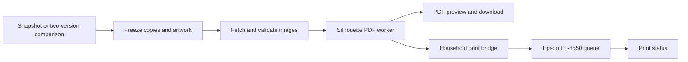

# Household PDF and printing workflow

Status: proposed next feature, reviewed 2026-09-08. **No PDF generator, print API, or
printer bridge is implemented in CLC yet.** This design builds on the existing snapshot,
paper-deck, artwork-selection, and image-download features. Household hardware settings
still need to be supplied and tested.

## Household equipment and materials

The exact Adobe and Epson settings are preserved in
[HOUSEHOLD_PRINT_RECIPE.md](HOUSEHOLD_PRINT_RECIPE.md). Adobe delegates color management
to the printer; the selected driver mode is EPSON Vivid. No custom ICC profile is shown.

Confirmed by the owner on 2026-09-08:

| Item | Known configuration |
| --- | --- |
| Printer | Epson EcoTank Photo ET-8550 |
| Cutter | Silhouette Cameo 5 Alpha (Cameo 5α) |
| Paper | Uinkit double-sided glossy inkjet photo paper |
| Sheet | US Letter, 8.5 × 11 inches |
| Stock | 200 gsm / 54 lb; listing in the supplied photo states 9.5 mil thickness |
| Feed | Rear feeder; double-faced batches are manually flipped and reloaded when prompted |
| Ordinary cards | Fronts only, printed separately from double-faced cards |
| After printing | Household drying, lamination and cutting; no tracking in CLC |

The paper details come from the owner's product photo. The stock's double-sided coating
is not a decision to use automatic duplex, nor an Epson driver media preset.

The [Cameo 5 Alpha](https://www.silhouetteamerica.com/silhouette-cameo-5-alpha) supports
four-point registration. Silhouette Card Maker supports `--registration 4`; its default is
three marks. Upstream also documents three-mark use with the Alpha by selecting Cameo 5 in
Studio. The owner's existing command below omits `--registration`, implying the default
three-mark layout. Preserve that recipe explicitly as `--registration 3` and confirm its
Studio machine setting/template. Four marks are an optional future recipe change, not an
automatic consequence of owning the Alpha.
[Upstream registration options](https://github.com/Alan-Cha/silhouette-card-maker#registration-marks)

Remaining inputs for a household proof:

- Current cutting template, Studio registration/machine setting and calibrated offsets.
  The command confirms upstream's standard 63 × 88 mm card size.
- Adobe product/version and the separate two-sided driver's binding/page-order/flip
  settings. The supplied screenshots establish the ordinary-card preset, including Epson
  Vivid, Ultra Premium Photo Paper Glossy, Best quality, rear feed and Actual Size.
  Record practical rear-feeder stack capacity.
- Where CLC runs and which Mac/Windows machine will host the printer bridge.

These inputs do not block the code-completeness pass. Implement and validate downloadable
PDFs before enabling physical queue submission.

### Existing Windows generation recipe

The owner supplied this working command (2026-09-08):

```bash
python create_pdf.py --card_size standard --ppi 600 --quality 100 --paper_size letter --crop 1mm --skip 4 --only_fronts
```

Preserve 600 PPI, quality 100, Letter, standard cards, 1 mm source crop and skipped slot
index 4. `--skip 4` skips the zero-based layout position, not four cards; include that empty
position in sheet-count and slot mapping. Do not silently replace this with generic 300 PPI
settings or upstream's MPC crop recommendation. Identify which source images were used to
calibrate the 1 mm crop before applying it to mixed Scryfall/MPC art.

Split each plan into ordinary-card and double-faced-card artifacts. Ordinary cards use
`--only_fronts` with an empty `double_sided/` directory. Double-faced cards use a separate
invocation with that flag omitted and matching front/back filenames; only these cards need
the manual refeed. Preserve all shared layout options in both invocations. A generic back
is unnecessary for this DFC-only batch; keep `back/` empty unless a later recipe calls for
one. Never silently add generic backs to the ordinary-card run.

The generator alternates front/back PDF pages. The printer bridge must reproduce the
Windows driver's working manual-duplex page order and orientation, pausing for flip/reload.
Ordinary-card printing can be queued unattended once its recipe is verified; DFC printing
still requires someone at the printer. Prevent other jobs from interleaving while that
batch is waiting for refeed. This is a physical paper-handling step, not drying tracking.

## Intended experience

From a tracked deck, a player chooses **Print latest snapshot** or **Print changes**.
Changes can use the marked paper snapshot or any explicit earlier snapshot as the baseline.
CLC shows the exact source and target versions, copies needed, unresolved artwork, and
sheet count. The player can download the PDF or send it to the configured household queue.
Once that printer recipe is validated, preparing and queueing can be one action.

Drying tracking is out of scope: the household normally waits about an hour before
laminating. Printing does not mark the physical deck as updated; the player updates the
paper marker when the cut and assembled deck actually matches the snapshot.



## What can be reused

| Existing CLC code | Contribution | Required extension |
| --- | --- | --- |
| `server/routes/snapshots.js` | Version text, comparisons, paper baseline | Resolve "latest" once when the request is created |
| `src/lib/parser.js`, `differ.js` | Counts, sections, printing metadata | Dedicated physical-copy planner with complete printing/face identity |
| `server/routes/decks.js`, `MpcOverlay.jsx` | Saved artwork choices | Freeze selected front/back IDs per job, rather than resolving again later |
| `server/lib/downloadQueue.js` | Persisted jobs, limits, progress, retries | Separate print lifecycle and durable submission history |
| `server/lib/scryfallImages.js`, `imageCache.js` | Original image acquisition and cache | Complete face/copy downloads now; add retention for immutable print jobs |

CLC's current ZIP downloads are asset exports. MPC ZIPs deduplicate image IDs; Scryfall
ZIPs expand quantities and require all requested faces, with paired DFC filenames in a flat
archive. Scryfall failures list missing cards/faces instead of returning partial ZIPs; older
unverified artifacts require regeneration. A print worker still needs a validated physical
manifest with page slots, selected art and generic backs; a complete asset ZIP is not that
manifest.

## Copy planning and reproducibility

For each included card identity, calculate `max(target quantity - baseline quantity, 0)`.
Whole-deck mode uses the full target quantity. Resolve commanders once (the parser already
includes them in mainboard). Aggregate across included zones before comparing, so moving a
card between mainboard and sideboard does not print a duplicate. Sideboard inclusion is an
explicit option; default it off for the initial Commander workflow.

Offer a clear choice between replacing cards for changed artwork/printings and keeping an
existing playable copy. A 2-to-5 increase needs three copies; a removal needs none. A DFC is
one physical card with two required faces. Reprinting an unchanged deck is a deliberate new
job, distinguishable from retrying an existing request.

### Future inventory-aware planning

The [ManaSync integration context](MANASYNC_INTEGRATION.md) adds a future mode that checks
available real cards and previously produced proxies before buying or printing more. The
snapshot delta above describes deck changes; it does not establish the household's missing
physical inventory. Account for deck allocations, pending purchases and job reservations,
while keeping explicit full-deck/reprint behavior available.

Once the companion contract is agreed, capture its inventory revision and any reservations
in the immutable print manifest. Record produced proxy quantities with an idempotent batch
reference; PDF creation or queue submission alone must not credit available physical copies.
The exact confirmation event is still an open design question. This adds no drying tracking.

The comparison identity now preserves name, set, collector and finish, with DFC aliases
handled in the differ. The physical planner must additionally freeze selected image
IDs/hashes and face pairing: MPC overrides still apply per card name. Decide explicitly
whether finish-only changes need a reprint; a home printer cannot reproduce foil stock.

Store an immutable manifest with:

- Requesting user, deck, resolved snapshot IDs **and text/hash**, mode, zones and copy counts.
- Selected art source/identifier, front/back mapping, content hash, dimensions and color-space
  information. Never silently switch art because a search ranking changed.
- Versioned paper/card dimensions, source crop rules, registration/template, resolution,
  generic back, calibrated offsets, and printer recipe/profile hash.
- Generator commit, output PDF hash, generated page/slot map, timestamps, submission key and
  local spooler job ID. Retain enough history to explain or deliberately repeat a print.

Fail preparation on missing or invalid faces; show the exact unresolved cards. Enforce
copy/page/file-size limits, disk retention and one bounded generator worker. Snapshot pruning
or later art edits must not alter a queued job's stored inputs.

## Silhouette PDF adapter

Upstream source: [Alan-Cha/silhouette-card-maker](https://github.com/Alan-Cha/silhouette-card-maker).
The printing-capable CLC container must include the Git/Python runtime and run this project's
actual PDF-generation code. An image ZIP plus instructions to run the tool manually is not
the intended integration. The current Alpine Node image does not yet include this runtime.
Preserve upstream licensing when distributing its code.

### Container updates and offline fallback — owner requirement

On container startup, clone the newest upstream `main` if no local copy exists, or fetch
the newest `origin/main` when a copy already exists. Keep the generator under the existing
data bind mount, for example `/app/data/silhouette-card-maker/`, so its usable source and
dependencies survive container replacement. "Latest" here means the upstream main-branch
HEAD at the successful update check, not the reference commit inspected below.

- Check for updates with a bounded timeout. A GitHub/DNS/network failure must leave the
  stored version intact and let PDF generation continue with that last working copy.
- Stage a candidate version separately, prepare its compatible Python dependencies, and
  run CLI/PDF smoke checks before promoting it. Failed fetches, dependency installs or
  validation must not overwrite the active working installation.
- Persist the usable dependency environment/cache as well as source, with a runtime/platform
  compatibility marker. Keeping only a clone is not sufficient for offline use if it still
  needs packages downloaded. Container runtime changes may require rebuilding dependencies;
  report an incompatible cache clearly rather than claiming offline readiness.
- Atomically select the validated version and retain the previous working version. Record
  the active commit, last successful check and any fallback reason in operational status.
- Give each job an immutable reference to its selected commit/dependencies. An update must
  not alter a running job; retain versions needed by active jobs and reproducible artifacts.
- If first startup has no usable cached installation and upstream cannot be reached, keep
  CLC available and report PDF generation unavailable with a retry path. There is no cached
  fallback to use in that case.

This automatic update/fallback behavior is a required part of the future implementation,
not an existing container capability. Update activation must validate any adapter/color
pipeline changes against the household recipe; never silently alter crop, scaling,
registration or color settings because upstream defaults changed.

This is a real compatibility issue: the owner's `Sauron.pdf` uses `letter_standard_v4`,
while the inspected latest CLI produces `letter-standard-v6`. Row positions, nominal card
size and registration marks differ. The [measured reference](HOUSEHOLD_PRINT_RECIPE.md#cutting-compatibility-v4-versus-latest-v6)
must be checked before accepting an update for the household recipe. Fetching the latest
source and activating it for an approved cutting template are separate operations.

### Headless feasibility proof (not yet integrated)

The inspected upstream HEAD ran in a disposable `node:22-alpine` container with Python
3.14.7 and `MPLBACKEND=Agg`. Its headless dependency subset is click, filetype, natsort,
Pillow, Pydantic, matplotlib and NumPy, using the versions pinned by upstream plus resolved
transitive dependencies. Binary musllinux wheels sufficed; no compiler or Windows/GUI
plugins were needed. The wheel cache was approximately 47 MiB and installed environment
201 MiB. Creating a fresh environment from that cache and regenerating PDFs with Docker
networking disabled both succeeded.

With the owner's 600 PPI recipe, nine ordinary fronts produced two pages (7 + 2 cards), and
two DFCs produced one front/back pair. Both outputs were landscape Letter, 792 × 612 points,
with 6600 × 5100 page images. Rendered checks confirmed the skipped lower-left slot and
paired DFC artwork. This verifies software feasibility only, not physical cutting/color.

Even two-page jobs peaked at roughly 824–948 MiB of process memory in this proof. Upstream
retains raster pages in memory. The adapter needs bounded sheet/chunk generation followed
by PDF merging, or another measured memory strategy, before accepting whole decks at
600 PPI. Preserve page order, labels, skipped slots and DFC pairing across chunk boundaries;
do not silently lower the owner's resolution to avoid the memory cost.

The inspection reference was commit `4d4aa73a95e93b09676c863a1861765863398c63`. Links below
document the interface reviewed at that point, not a permanent version pin. The adapter must
detect incompatible upstream changes and keep using its last working installation.

The [CLI](https://github.com/Alan-Cha/silhouette-card-maker/blob/4d4aa73a95e93b09676c863a1861765863398c63/create_pdf.py)
accepts explicit input/output paths, paper/card sizes, registration mode and resolution.
Example adapter invocation preserving the owner's ordinary-card recipe. The container path
and explicit registration choice still need validation against the existing Windows output:

```bash
/app/data/silhouette-card-maker/active/venv/bin/python \
  /app/data/silhouette-card-maker/active/source/create_pdf.py \
  --front_dir_path /job/front \
  --back_dir_path /job/back \
  --double_sided_dir_path /job/double_sided \
  --output_path /job/output/deck.pdf \
  --paper_size letter --card_size standard --registration 3 \
  --ppi 600 --quality 100 --crop 1mm --skip 4 --only_fronts
```

Invoke using an argument array, validated executable and timeout, with closed stdin and an
isolated job working directory. The example shows the active installation; the worker must
resolve it to an immutable version path when claiming a job. The final recipe must match
the actual cutter template.

The upstream [image staging code](https://github.com/Alan-Cha/silhouette-card-maker/blob/4d4aa73a95e93b09676c863a1861765863398c63/utilities.py)
requires a unique numbered front filename per copy and a matching filename stem for
its DFC back in `double_sided/` (the inspected version accepts differing extensions).
Create all directories. The household DFC-only batch can leave `back/` empty; if a future
recipe uses a generic back, supply exactly one to avoid an interactive choice.
Ordinary cards sort before DFCs, so derive the slot manifest
from that ordering. Front-only mode requires separate staging: `--only_fronts` rejects a
populated DFC directory. Isolate saved offset data per versioned recipe.

Normalize bleed per source before mixing images. The upstream
[MPC guidance](https://github.com/Alan-Cha/silhouette-card-maker/tree/4d4aa73a95e93b09676c863a1861765863398c63/plugins/mtg)
describes cropping bleed; applying that crop to ordinary Scryfall images would remove card
content. Check physical card size, registration, back alignment and actual-size printing
against the cutter template. Avoid fit-to-page and uncalibrated borderless expansion.

## Color: transferable files, separately validated print settings

The supplied working recipe is printer-managed EPSON Vivid, with Adobe's "Let printer
determine colors" enabled. Reproduce that path first; a custom ICC export is not currently
a prerequisite because no custom profile is shown. The general ICC guidance below applies
if a later calibrated recipe uses one.

An actual `.icc` or `.icm` profile is portable; these extensions identify the same format.
Copy the original profile, including a custom paper profile if used.
[ICC FAQ](https://www.color.org/faqs/)

Windows commonly stores installed profiles under
`%SystemRoot%\System32\Spool\Drivers\Color`.
[Microsoft profile documentation](https://learn.microsoft.com/en-us/dotnet/api/system.drawing.imaging.imageattributes.setoutputchannelcolorprofile)
On macOS, user profiles belong in `~/Library/ColorSync/Profiles`; system-wide profiles use
`/Library/ColorSync/Profiles`. [Apple ColorSync profiles](https://developer.apple.com/documentation/colorsync/color-profiles)

Epson driver presets and sliders are separate settings. Record paper type, feed path,
quality, density/color adjustments, scaling, application, and which component manages
color. Copying the ICC alone does not guarantee a Windows/Mac match.
[Epson Windows color controls](https://files.support.epson.com/docid/cpd5/cpd59879/source/printers/source/printing_software/windows_fy13/reference/custom_color_options_windows_bus_wf3012.html),
[Epson Mac color controls](https://files.support.epson.com/docid/cpd5/cpd59879/source/printers/source/printing_software/mac_fy13/references/color_management_options_mac_fy13.html)

Upstream page composition does not itself implement an ICC-managed print pipeline.
Normalize source images into a declared working space, preserve/embed the appropriate
profile in generated output, and apply the printer/paper conversion exactly once through
a tested rendering path. This is an integration requirement, not a capability guaranteed
by placing a profile file on the Mac. [Pillow color management](https://pillow.readthedocs.io/en/stable/reference/ImageCms.html)

Compare a representative proof with the current Windows output after drying and lamination.
A bridge on Windows can preserve the existing printing setup while the Mac recipe is tested.

## Printer bridge and physical handling

Run a small authenticated service on the Mac or Windows machine that can reach the Epson.
It polls CLC for authorized jobs, retrieves the immutable PDF and submits through a locally
configured recipe. This also works when CLC runs in Docker or on a different server.
The web browser does not provide the unattended printer connection.

On macOS, CUPS exposes destinations, installed options, held jobs and job IDs. Discover the
actual Epson queue rather than inventing universal ICC or media options. A macOS GUI preset
is not proof that `lp` will use the same color rendering.
[CUPS options](https://www.cups.org/doc/options.html),
[CUPS lp](https://www.cups.org/doc/man-lp.html),
[Apple print presets](https://support.apple.com/en-gb/guide/mac-help/mchl09087a64/mac)

Use a scoped bridge credential, authorized household users, fixed printer destinations,
and allowed recipe IDs. Persist a lease and submission intent before contacting the
spooler. If the bridge crashes after submission but before recording the job ID, mark the
outcome uncertain and reconcile locally; automatic retries can duplicate physical output.
Do not expose arbitrary shell commands, executable paths or printer addresses to clients.

Keep preparation, PDF ready, waiting for printer, submitted, printing, awaiting manual refeed, printed,
failed, canceled and uncertain states distinct. Removing a CLC job does not
guarantee cancellation of an already submitted spooler job. Surface that actual result.

The ET-8550 rear feed slot takes one sheet at a time, including 0.61–1.3 mm thick stock;
other capacities depend on the selected media. Confirm that the actual paper and duplex
workflow permit unattended feeding before promising unattended batches.
[Epson paper capacity](https://files.support.epson.com/docid/cpd5/cpd59879/source/printers/source/paper_loading/reference/et8500_8550_l8160_l8180/paper_loading_capacity_us_can_et8500.html),
[Epson duplex restrictions](https://files.support.epson.com/docid/cpd5/cpd59879/source/printers/source/paper_loading/reference/et8500_8550_l8160_l8180/double_sided_capacity_us_can_et8500.html)

No drying timer, readiness estimate, lamination state, or cutting queue is needed. Those
steps stay in the household's existing routine after printing.

## Implementation sequence and acceptance

1. **Planner and PDF download:** implement immutable manifests, full/delta counts, image
   completeness, integrated generator/update cache, adapter, preview and cancel/retry.
   Verify first online clone, successful update, unreachable upstream with a cached copy,
   failed candidate install/validation, offline container recreation, concurrent jobs during
   updates, and the no-cache/offline failure state. Test removals, quantity increases,
   repeated art, multi-printings, DFCs, zone moves, empty changes and same-second snapshots.
   Render PDFs and verify size, page count, every front/back slot, registration and color tags.
2. **Household proof:** capture the current Windows recipe, choose the exact matching cutter
   template, then verify one printed sheet's dimensions, color and back alignment after the
   actual drying/lamination process. Validate media feeding and any manual duplex step.
3. **Queue integration:** implement bridge pairing, authorization, durable submission IDs,
   status and cancellation. Test offline printer, process restarts, concurrent requests,
   duplicate clicks and ambiguous submissions with a fake spooler before physical jobs.
4. **Routine use:** enable the one-action queue option for the validated recipe and display
   print progress. Keep reprints and paper-marker updates explicit.

The confirmed paper/printer/cutter and remaining household inputs are listed above.
The example recipe remains unvalidated until its template, feed path, front/back handling
and color settings have been checked against the owner's existing output.
